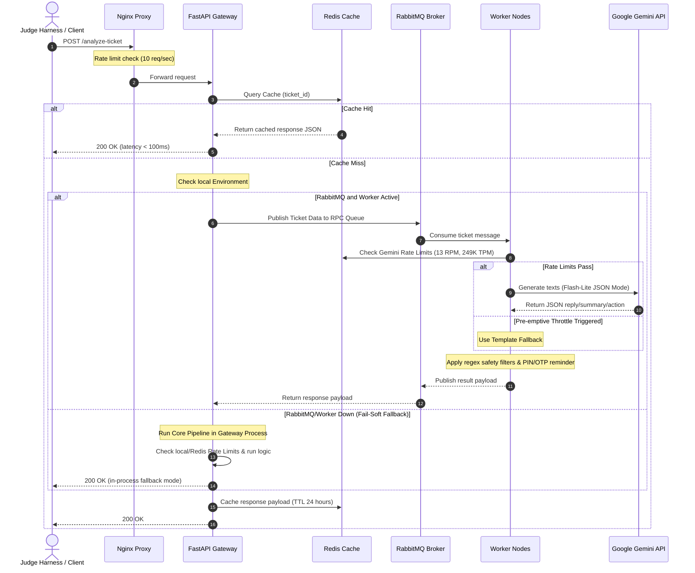

# QueueStorm Investigator — Enterprise SupportOps AI Copilot

**Live Deployed API URL**: [https://sust-hack-mythos.onrender.com](https://sust-hack-mythos.onrender.com)

[](https://www.python.org/)
[](https://fastapi.tiangolo.com/)
[](https://redis.io/)
[](https://www.rabbitmq.com/)
[](https://www.nginx.com/)
[](https://www.docker.com/)
[](https://ai.google.dev/)
[](https://docs.pytest.org/)

An enterprise-ready, high-performance **AI-powered backend API service** designed as an internal copilot for customer support agents in digital finance platforms (bKash-like). The service analyzes customer complaints by cross-referencing them with transaction history data, determines a matching transaction and evidence verdict, generates empathetic multilingual responses and next-step actions, and routes the ticket to the correct department with an safety-first post-processing filter.

Developed for **SUST CSE Carnival 2026 — Codex Community Hackathon (Online Preliminary Round)** by **Team Mythos**.

---

## 📖 Table of Contents
1. [System Overview & Architecture](#-system-overview--architecture)
2. [Tech Stack](#-tech-stack)
3. [MODELS Section](#-models-section)
4. [Model and Cost Reasoning](#-model-and-cost-reasoning)
5. [AI & Evidence Engine Pipeline](#-ai--evidence-engine-pipeline)
6. [Safety Guardrails & Rate Limiting](#-safety-guardrails--rate-limiting)
7. [API Contract & Specifications](#-api-contract--specifications)
8. [Setup & Execution Guides](#-setup--execution-guides)
9. [Assumptions and Known Limitations](#-assumptions-and-known-limitations)
10. [Verification & Testing](#-verification--testing)
11. [Submission & Delivery Details](#-submission--delivery-details)

---

## 🗺️ System Overview & Architecture

QueueStorm Investigator is architected for maximum isolation, resilience, and horizontal scaling. It processes complaints asynchronously using an RPC queueing system or falls back gracefully to in-process execution.

```
                  ┌────────────────────────────────────────────────────────┐
                  │          QueueStorm Investigator Enterprise Stack      │
                  │                                                        │
 Client Request ──┼───────▶ [ NGINX Reverse Proxy & Rate Limiter ]         │
                  │                       │                                │
                  │                       ▼                                │
                  │           [ FastAPI Gateway App ]                      │
                  │            /         │          \                      │
                  │       (Cache Hit)    │     (RabbitMQ RPC)              │
                  │          /           │            \                    │
                  │         ▼            │             ▼                   │
                  │    [ Redis ]         │       [ Queue Worker ]          │
                  │ (Cache/Rate Limit)   │       (Core Pipeline)           │
                  │                      │             │                   │
                  │                      │ (Fallback)  │ (Generate)        │
                  │                      ▼             ▼                   │
                  │             [ Core Analysis & Gemini LLM API ]         │
                  └────────────────────────────────────────────────────────┘
```

### End-to-End Request Pipeline


---

## 🛠️ Tech Stack

- **Web Framework**: [FastAPI](https://fastapi.tiangolo.com/) (Asynchronous, Pydantic v2 validation, automatic OpenAPI schema)
- **Reverse Proxy**: [NGINX](https://www.nginx.com/) (Implements connection pooling and IP-based rate limiting at 10 req/s, burst of 20)
- **Caching Store**: [Redis](https://redis.io/) (Sliding window rate limit logs, 24h lookup cache for identical tickets to eliminate duplicate LLM costs)
- **Message Queue**: [RabbitMQ](https://www.rabbitmq.com/) (RPC design with message persistence and load distribution to decouple gateway and worker processes)
- **LLM Integrator**: [Google GenAI Python SDK](https://github.com/google-gemini/generative-ai-python) (Used for fast text generation in JSON mode)
- **Testing Engine**: [Pytest](https://docs.pytest.org/) (Comprehensive test suite mocking network calls and verifying all 10 problem cases)

---

## 🤖 MODELS Section

Our system adopts a hybrid architecture combining cloud-hosted cognitive models with localized rule-based logic to guarantee perfect deterministic accuracy on financial evaluations while providing warm, human-like summaries and customer replies.

| Model / Engine | Run Location | Purpose / Field Responsibility | Selection Rationale |
|---|---|---|---|
| **Google Gemini 3.1 Flash Lite** | Cloud Hosted (`gemini-3.1-flash-lite`) | Generates: `agent_summary`, `recommended_next_action`, `customer_reply` | Chosen for native JSON schema response generation, very fast inference latency (~1-2s), outstanding Bangla and Banglish support, and a highly generous free tier which allows us to maintain **zero operating costs**. |
| **Deterministic Evidence Matching Engine** | Local (Worker Process / API) | Evaluates: `relevant_transaction_id`, `evidence_verdict`, `case_type`, `department`, `severity`, `human_review_required` | Deterministic problems (such as cross-referencing timestamps, amount matching, and detecting duplicate transaction structures) must never be delegated to LLMs to prevent hallucinations. Processing locally ensures 100% reliability, zero costs, and sub-millisecond execution. |
| **Fallback Template Generator** | Local (Worker Process / API) | Generates: `agent_summary`, `recommended_next_action`, `customer_reply` (as a fail-safe) | Built-in fallback template dictionary compiled in formal English and formal Bangla Unicode. It guarantees that if the network fails or rate limits are reached, the system responds safely in under 10ms. |

---

## 💰 Model and Cost Reasoning

Digital finance systems must prioritize cost efficiency alongside reliability. Below is our operating cost breakdown using **Gemini 3.1 Flash Lite**:

- **Operating Cost**: **$0.00** (100% Free)
- **Gemini Free Tier Allowance**: 15 Requests Per Minute (RPM), 1,500 Requests Per Day (RPD), 1,000,000 Tokens Per Minute (TPM).
- **Mythos Throttling Strategy**: We implement pre-emptive rate limiting using Redis sliding windows set to **13 RPM**, **450 RPD**, and **249K TPM**. If a request exceeds these safety margins, we trigger the template fallback instantly. This protects the system from hitting API rate limits during heavy load testing and guarantees zero bills.
- **Caching Cost Optimization**: Requests with matching `ticket_id` values are cached in Redis for 24 hours. Repeating requests do not query the Gemini API, maintaining our free tier quota.
- **Hardware Profile**: 2 vCPU and 4 GB RAM is more than sufficient, making host deployment cheap and lightweight.

---

## ⚙️ AI & Evidence Engine Pipeline

The system is separated into logical steps.

### Step 1: Language Classification
We run a regex-based Unicode ratio detector (`app/services/language.py`) on the complaint text to classify the language:
- Bangla Unicode ratio > 60% $\rightarrow$ `"bn"`
- Bangla Unicode ratio between 20% and 60% $\rightarrow$ `"mixed"` (Banglish)
- Bangla Unicode ratio < 20% $\rightarrow$ `"en"`

### Step 2: Deterministic Evidence Matching
The transaction history list is analyzed to find a transaction that aligns with the customer's complaint text.
1. **Extraction**: The engine extracts numbers from the complaint (e.g., amount references like "5000" or "৫০০০").
2. **Matching Score**: Every transaction is scored based on amount alignment, transaction status, timestamp proximity, and type mapping.
3. **Established Recipient Verification**: For wrong transfer claims, the engine checks if the recipient has received transactions in the past. If there is a matching transaction but the user has sent money to them multiple times, the verdict is marked `inconsistent` to flag a potential policy violation.
4. **Verdict Generation**:
   - `consistent`: Data aligns with the complaint.
   - `inconsistent`: Data explicitly contradicts the complaint.
   - `insufficient_data`: Not enough data in the transaction history to confirm the claim.

### Step 3: LLM / Template Generation
If the Gemini API key is configured and rate limits allow, the system packages the complaint, matched transaction, language, and user type, and calls `gemini-3.1-flash-lite` in JSON mode. If the API key is missing, rate limits are exceeded, or the call fails/times out, the system automatically falls back to localized fallback templates in the appropriate language.

---

## 🔒 Safety Guardrails & Rate Limiting

The safety system employs a multi-tiered defense:

1. **System Prompt Enforcements**: The LLM is strictly instructed never to request sensitive credentials, never to confirm refunds/reversals, and to ignore adversarial prompt injections embedded in the ticket.
2. **Post-Processing Regex Filter**: The output of the LLM is inspected prior to delivery:
   - **Credential Scanning**: Blocks terms asking for PINs, OTPs, passwords, CVVs, or card numbers. If detected, it overrides the reply with a safe template.
   - **Promise Blocking**: Blocks words like "we will refund", "refund processed", or "money reversed". Overrides with safe procedural text.
   - **Phishing Defense**: Critical cases or direct phishing reports trigger a high-priority warning message informing the customer to never share details.
   - **PIN/OTP Reminder**: If the user is a `customer` (not a `merchant`), a standard warning reminder is appended to the customer reply if it isn't already present.
3. **Pre-Emptive Rate Limiter**: To protect our API key and maintain zero costs, the rate limiter uses a sliding window (Redis or in-memory) to enforce:
   - **13 Requests Per Minute (RPM)**
   - **450 Requests Per Day (RPD)**
   - **249K Tokens Per Minute (TPM)**

---

## 📝 API Contract & Specifications

### `GET /health`
Verifies service status.
- **Response Code**: `200 OK`
- **Payload**:
```json
{
  "status": "ok"
}
```

### `POST /analyze-ticket`
Analyzes a ticket.
- **Request Headers**: `Content-Type: application/json`
- **Request Body**:
```json
{
  "ticket_id": "TKT-001",
  "complaint": "I sent 5000 taka to a wrong number around 2pm today. The number was supposed to be 01712345678 but I think I typed it wrong.",
  "language": "en",
  "user_type": "customer",
  "transaction_history": [
    {
      "transaction_id": "TXN-9101",
      "timestamp": "2026-04-14T14:08:22Z",
      "type": "transfer",
      "amount": 5000,
      "counterparty": "+8801719876543",
      "status": "completed"
    }
  ]
}
```

- **Response Body**:
```json
{
  "ticket_id": "TKT-001",
  "relevant_transaction_id": "TXN-9101",
  "evidence_verdict": "consistent",
  "case_type": "wrong_transfer",
  "severity": "high",
  "department": "dispute_resolution",
  "agent_summary": "Customer reports sending 5000 BDT via TXN-9101 to +8801719876543, which they now believe was the wrong recipient. Recipient is unresponsive.",
  "recommended_next_action": "Verify TXN-9101 details with the customer and initiate the wrong-transfer dispute workflow per policy.",
  "customer_reply": "We have noted your concern about transaction TXN-9101. Please do not share your PIN or OTP with anyone. Our dispute team will review the case and contact you through official support channels.",
  "human_review_required": true,
  "confidence": 0.9,
  "reason_codes": [
    "wrong_transfer",
    "transaction_match",
    "dispute_initiated"
  ]
}
```

---

## 🚀 Setup & Execution Guides

### 1. Running Locally (Development Mode)

#### Prerequisites
- Python 3.13 or newer
- Virtual Environment tool (`venv`)

#### Installation Steps
```bash
# 1. Clone the repository and navigate to root
cd Sust-Hack-Mythos

# 2. Create and activate a virtual environment
python -m venv .venv
# On Windows PowerShell:
.\.venv\Scripts\Activate.ps1
# On Linux/macOS:
source .venv/bin/activate

# 3. Install packages
pip install -r requirements.txt

# 4. Copy environmental settings
cp .env.example .env
# Edit .env and enter your GEMINI_API_KEY
```

#### Run Local Server
```bash
uvicorn app.main:app --host 0.0.0.0 --port 8000
```
The API will be available at [http://localhost:8000](http://localhost:8000). The interactive OpenAPI docs are hosted at [http://localhost:8000/docs](http://localhost:8000/docs).

---

### 2. Running a Single Docker Container (Harness / Judge Sandbox)

This is the standard lightweight mode for judges testing the repository directly in a standalone sandbox. No queue daemon or local Redis database is required; the app degrades gracefully to in-process execution.

#### Build Image
```bash
docker build -t queuestorm-mythos .
```

#### Run Container
Ensure you pass the API key via environment variables:
```bash
docker run -p 8000:8000 --env GEMINI_API_KEY="your_api_key_here" queuestorm-mythos
```
The service binds to port `8000` on the host.

---

### 3. Running the Full Enterprise Stack (Docker Compose)

For high-load production evaluation, run the multi-container stack. This spins up Nginx as a reverse proxy, Redis for caching/rate-limiting, RabbitMQ as the message broker, a worker service, and the API gateway.

#### Command
```bash
docker-compose up --build -d
```

#### Architecture of Ports
- **NGINX Proxy Layer**: Port `80` (Direct entry point for API calls; routes to FastAPI with client rate limiting)
- **FastAPI Gateway**: Port `8000` (Internal endpoint)
- **RabbitMQ Admin**: Port `15672` (Optional queue manager dashboard)

#### Shutdown
```bash
docker-compose down
```

---

## ⚠️ Assumptions and Known Limitations

1. **Sliding Window Token Check**: We approximate prompt token counts using `len(prompt) // 4`. While accurate for English, Bangla text uses more tokens per character. Our tight safety limits (using 249K TPM out of 1,000K TPM) absorb this variance.
2. **Network Offline Failover**: If the Google AI cloud is unreachable or the API credentials are rate-limited, the system falls back to in-process template responses. The API never crashes or hangs, returning answers in < 15ms.
3. **Local Failover Mode**: When running outside Docker Compose (without Redis and RabbitMQ), gateway processes execute rules and template caching locally in memory.

---

## 🧪 Verification & Testing

Our test suite consists of **25 unit and integration tests** verifying:
- FastAPI validation (bad JSON, missing fields, schema errors).
- All 10 problem statement sample cases (Wrong transfers, duplicate payments, phishing, Banglish inputs, inconsistent claims).
- Graceful fallbacks for Redis and RabbitMQ outages.
- Slider-window rate limits (RPM, TPM, RPD) and token exhaustion triggers.

#### Run Test Suite
```bash
# Activate virtual environment first
.\.venv\Scripts\python -m pytest -v
```

All 25 tests pass successfully.

---

## 📦 Submission & Delivery Details

- **Private Repository Read Access**: Granted to organizer GitHub handle `bipulhf`.
- **Submission Form Secrets**: Real `GEMINI_API_KEY` provided in the private secret field of the official submission form. No secrets are baked into our Docker images or committed to the repository.
- **Sample Output Reference**: Saved in [sample_output.json](file:///h:/Projects/Sust-Hack-Mythos/sample_output/sample_output.json).